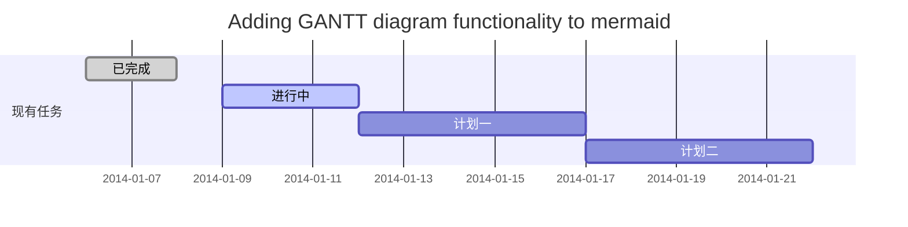
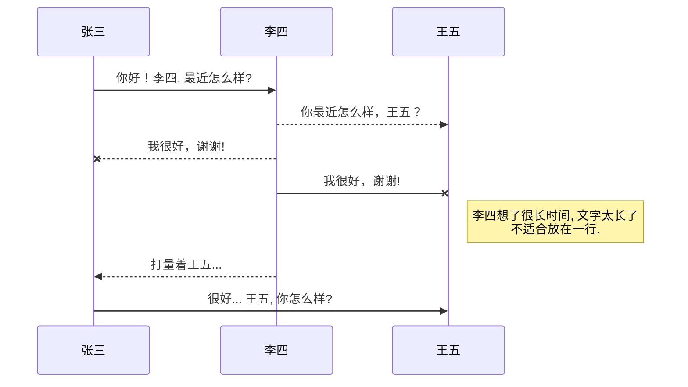
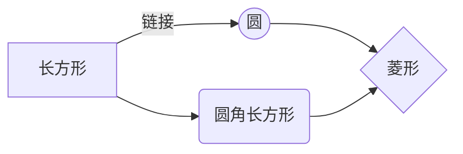

>文章来自[CSDN](https://mp.csdn.net/mdeditor?not_checkout=1#_61)

# 我该如何放弃她  全心全意爱上你

她，富文本编辑器，花枝招展、姿态万千，人们都爱她包括我在内。

而你，Markdown，成熟朴素、不食烟火，让我着了迷，我决定要追随你！

### Markdown简介

Markdown是一种纯文本格式的标记语言。通过简单的标记语法，它可以使普通文本内容具有一定的格式。

上题说富文本编辑器花枝招展、姿态万千，从字面上解释可能会有点不着边，但是结合富文本编辑的特点就可以知道：花枝招展指的是富文本的编辑功能多而且强大；姿态万千是因为现在市面上富文本编辑器多种多样
UEditor、kindeditor、simditor等等，而且可以自由的拓展插件，但是缺点是需要查看对应的开发文档，一旦有更新迭代可能还会有不兼容的问题。

相对的Markdown编辑器就简单多了，只需要记住几个标点符号使用的语法就可以编写丰富的内容，但缺点是只支持部分平台，这也是为什么说她成熟朴素、不食烟火的缘故了。值得庆幸的是markdown的影响越来越大，受支持的平台也在慢慢增多。

# Markdown语法

## 合理的创建标题，有助于目录的生成

直接输入1次<kbd>#</kbd>，并按下<kbd>space</kbd>后，将生成1级标题。
输入2次<kbd>#</kbd>，并按下<kbd>space</kbd>后，将生成2级标题。
以此类推，一般支持6级标题。

    # 一级标题
    ## 二级标题
    ### 三级标题

# 一级标题
## 二级标题
### 三级标题


## 如何改变文本的样式

    *强调文本* _强调文本_

    **加粗文本** __加粗文本__

    ==标记文本==

    ~~删除文本~~

    > 引用文本

    H~2~O is是液体。

    2^10^ 运算结果是 1024.

*强调文本* _强调文本_

**加粗文本** __加粗文本__

==标记文本==

~~删除文本~~

> 引用文本

H~2~O is是液体。

2^10^ 运算结果是 1024.


## 插入链接与图片

     链接: [这是一个链接](https://oumuv.github.io/).

     图片: 

链接: [这是一个链接](https://oumuv.github.io/).

图片: 


## 如何插入一段漂亮的代码片


```javascript
// An highlighted block
var foo = 'bar';
```


## 生成一个适合你的列表

    - 项目
      - 项目
        - 项目

    1. 项目1
    2. 项目2
    3. 项目3

    - [ ] 计划任务
    - [x] 完成任务

- 项目
  - 项目
    - 项目

1. 项目1
2. 项目2
3. 项目3

- [ ] 计划任务
- [x] 完成任务


## 创建一个表格
一个简单的表格是这么创建的：

    项目     | Value
    -------- | -----
    电脑  | $1600
    手机  | $12
    导管  | $1

项目     | Value
-------- | -----
电脑  | $1600
手机  | $12
导管  | $1

### 设定内容居中、居左、居右
使用`:---------:`居中
使用`:----------`居左
使用`----------:`居右

      | 第一列       | 第二列         | 第三列        |
      |:-----------:| -------------:|:-------------|
      | 第一列文本居中 | 第二列文本居右  | 第三列文本居左 |

| 第一列       | 第二列         | 第三列        |
|:-----------:| -------------:|:-------------|
| 第一列文本居中 | 第二列文本居右  | 第三列文本居左 |

### SmartyPants
SmartyPants将ASCII标点字符转换为“智能”印刷标点HTML实体。例如：

|    TYPE   |ASCII                          |HTML                         
|----------------|-------------------------------|-----------------------------|
|Single backticks|`'Isn't this fun?'`            |'Isn't this fun?'            |
|Quotes          |`"Isn't this fun?"`            |"Isn't this fun?"            |
|Dashes          |`-- is en-dash, --- is em-dash`|-- is en-dash, --- is em-dash|


## 创建一个自定义列表

Markdown
:  Text-to-HTML conversion tool

Authors
:  John
:  Luke


## 如何创建一个注脚

      一个具有注脚的文本。[^2]

      [^2]: 注脚的解释

一个具有注脚的文本。[^2]

[^2]: 注脚的解释

##  注释也是必不可少的

    Markdown将文本转换为 HTML。

    *[HTML]:   超文本标记语言

Markdown将文本转换为 HTML。

*[HTML]:   超文本标记语言


## KaTeX数学公式

您可以使用渲染LaTeX数学表达式 [KaTeX](https://khan.github.io/KaTeX/):

Gamma公式展示 $\Gamma(n) = (n-1)!\quad\forall
n\in\mathbb N$ 是通过欧拉积分

$$
\Gamma(z) = \int_0^\infty t^{z-1}e^{-t}dt\,.
$$

> 你可以找到更多关于的信息 **LaTeX** 数学表达式[here][1].


## 新的甘特图功能，丰富你的文章


- 关于 **甘特图** 语法，参考 [这儿][2],

## UML 图表

可以使用UML图表进行渲染。 [Mermaid](https://mermaidjs.github.io/). 例如下面产生的一个序列图：:



这将产生一个流程图。:



- 关于 **Mermaid** 语法，参考 [这儿][3],

## FLowchart流程图

我们依旧会支持flowchart的流程图：
```mermaid
flowchat
st=>start: 开始
e=>end: 结束
op=>operation: 我的操作
cond=>condition: 确认？

st->op->cond
cond(yes)->e
cond(no)->op
```

- 关于 **Flowchart流程图** 语法，参考 [这儿][4].


 [1]: http://meta.math.stackexchange.com/questions/5020/mathjax-basic-tutorial-and-quick-reference
 [2]: https://mermaidjs.github.io/
 [3]: https://mermaidjs.github.io/
 [4]: http://adrai.github.io/flowchart.js/