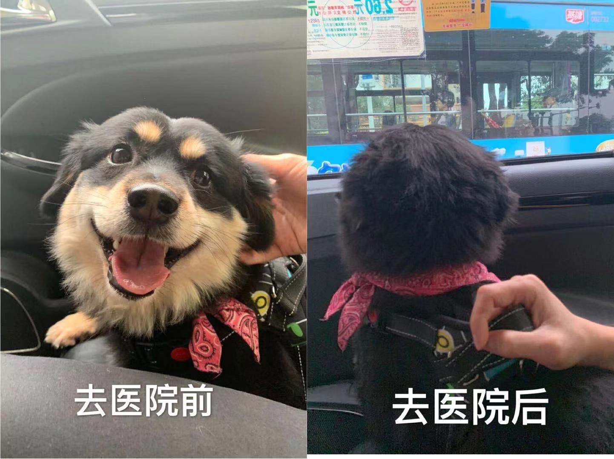

> 看完支付宝的年度账单、各种年度总结，觉得我也该来个总结汇报了🙂

## 工作 & 生活

2019年初，拿到了驾照，这件事其实是18年的计划，延期了不过也算顺利完成了一个小目标；

4月份，厌倦了摸鱼式的工作，离开了毕业后的第一家公司；

5月份，面试了三个星期，最后从手中四个Offer中挑了我现在的这家公司，面试过程中的辛酸和拿到Offer后的喜悦还历历在目；

6月份，为了上班方便，搬了家；

8月份，公司的一个合作项目三个多月驻场开发结束，项目夭折了，回归公司老巢；

9月份，开始做新项目，公司计划扩大规模，公司搬迁；

就这样，乱中有序、说忙不忙的一年就这么过去了，这一年中做过最正确的事或许是跳槽吧，有时候换个环境，多出去走走真的是件好事。温水煮青蛙的典故差点在我身上重演😅

这一年里我开始买起了基金、开始养信用卡，开始学着做些像样的能拿得出手的菜，路过某某正在封顶的小区会刻意的打听楼盘价格，为母亲计划着未来的养老生活，空想着怎么创业却因为没有好的idea而原地踏步。事业上、爱情上、父母、未来的孩子、房贷车贷…乱七八糟的思绪时常出现，这可能就是是成年人的烦恼吧。

## 不开心的事

大家都希望自己的人生一帆风顺，却往往事与愿违。今年有两件事情比较闹心，姥姥在家摔伤了，咱家的狗娃子去医院做了场手术。

## 开心的事情

说完不开心的事情当然需要有开心的事情来调节一下气氛了，就在写这篇文的前一天，领导给咱挨个开了小会，内容就是涨薪和奖金✌️。有生以来第一次见到这么主动的领导，预计涨幅22%，奖金也比我自己预想的更有诚意。

